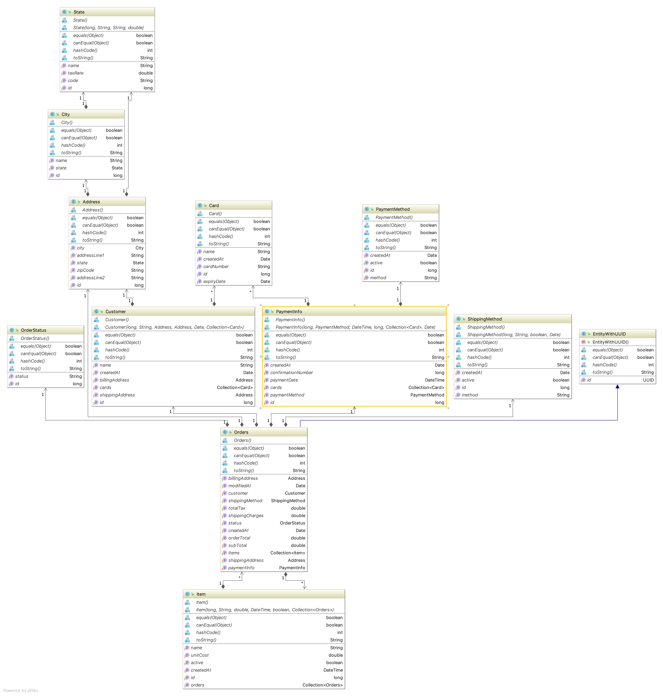

# Order Service

## Steps to build the docker image

After cloning this repo run the following to build the docker image:

```docker build -t  order-service-dev-build:1.0```

Run the docker image as:

```docker run -p 8080:8080 -t order-service-dev-build:1.0 --spring.datasource.url=[{url} --spring.kafka.bootstrap-servers:{brokerlist}```

## DB Design / Entity-Relation Diagram



## Order Service APIs

_Swagger Documentation can be referred after running the service by visiting : http://localhost:8080/swagger-ui.html#/order-controller_

### 1. Create new Order 

    curl --location --request POST 'localhost:8080/api/order' \
    --header 'Content-Type: application/json' \
    --data-raw '{
        "customer": {
            "id": 1
        },
        "items": [
            {
                "id": 1,
                "quantity": 1
            },
            {
                "id": 2,
                "quantity": 1
            }
        ],
        "shippingMethod": {
            "id": 1
        },
        "shippingCharges": 10.95,
        "totalTax": 30,
        "subTotal": 50.35,
        "orderTotal" : 90.95,
        "shippingAddress": {
            "id": 1
        },
        "billingAddress": {
            "id": 1
        },
        "paymentInfo": {
            "paymentMethod": {
                "id": 1
            },
            "cards": [
                {
                    "id": 1
                },
                {
                    "id": 2
                }
            ]
        }
    }'
    
    
#### Response

    {
        "message": "Successfully created enity.",
        "id": "e0ef00ca-f6d8-42c2-8b38-09c51c78f0ad"
    }
    
--

### 2. Get Order by Id

    curl --location --request GET 'localhost:8080/api/order?orderId=e0ef00ca-f6d8-42c2-8b38-09c51c78f0ad'
 
 #### Sample Response
 
 
    {
        "orderId": "e0ef00ca-f6d8-42c2-8b38-09c51c78f0ad",
        "customer": {
            "id": 1
        },
        "items": [
            {
                "id": 1,
                "quantity": 1.0
            },
            {
                "id": 2,
                "quantity": 1.0
            }
        ],
        "shippingMethod": {
            "id": 1
        },
        "shippingAddress": {
            "id": 1,
            "addressLine1": "1024 s claremont",
            "addressLine2": "apt 2",
            "city": {
                "id": 1,
                "name": "Chicago"
            },
            "state": {
                "id": 1,
                "name": "Illinois"
            },
            "zipCode": "60607"
        },
        "billingAddress": {
            "id": 1,
            "addressLine1": "1024 s claremont",
            "addressLine2": "apt 2",
            "city": {
                "id": 1,
                "name": "Chicago"
            },
            "state": {
                "id": 1,
                "name": "Illinois"
            },
            "zipCode": "60607"
        },
        "orderStatus": null,
        "paymentInfo": {
            "orderId": 0,
            "paymentMethod": {
                "id": 1,
                "method": "Credit Card"
            },
            "paymentDate": null,
            "confirmationNumber": 0,
            "cards": [
                {
                    "id": 1,
                    "cardNumber": "1234567890",
                    "name": "Mohammed Siddiq"
                },
                {
                    "id": 2,
                    "cardNumber": "1234567832",
                    "name": "Mohammed Siddiq"
                }
            ]
        },
        "shippingCharges": 10.95,
        "subTotal": 50.35,
        "totalTax": 30.0,
        "orderTotal": 90.95
    }
    
    
--

### 3. Cancel Order

    curl --location --request GET 'localhost:8080/api/order/cancel?orderId=e0ef00ca-f6d8-42c2-8b38-09c51c78f0ad'
         

#### Response

    {
        "message": "Successfully cancelled Order",
        "id": "e0ef00ca-f6d8-42c2-8b38-09c51c78f0ad"
    }
   
-   
      {
          "message": "Order id not found",
          "id": "e0ef00ca-f6d8-42c2-8b38-09c51c78f0a2"
      }
      
      
## Bulk order Support through Kafka


